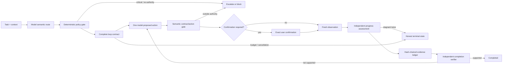
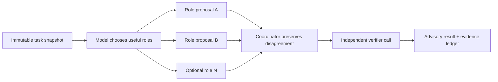

# Oh My Loop

> Safety-first loops for code, decisions, habits, and life reviews.

Oh My Loop is an **alpha** methodology and persistent runtime for building bounded, observable, human-governed loops. It helps an agent decide when not to loop, when to verify, when to ask for confirmation, and when to stop or escalate.

中文：[可信模型](docs/zh/trust-model.md) · English: [Trust model](docs/en/trust-model.md)

## Why this exists

A useful loop is more than “try again until it looks good.” Coding can often use tests as an oracle. Life cannot: values change, evidence is incomplete, other people are affected, and optimizing a proxy can reduce wellbeing. Oh My Loop therefore treats these as first-class:

```text
Loop = Contract + State + Actors + Actions + Observations
     + Gates + Memory + Budget + Governance
```

The runtime is a recoverable control plane:



## Safety invariants

- A model evaluates semantic intent and risk before any “trivial task” shortcut; there is no keyword fallback.
- Crisis signals stop automation; high-impact life tasks are advisory only.
- The user remains decision owner for consequential life choices.
- Irreversible or external actions require fresh, exact-action confirmation.
- Empty or broken verification fails closed; completion requires evidence.
- Iteration, time, cost, stagnation, cancellation, and partial results are explicit.
- Memory capability is enabled by default. New personal memory remains quarantined; persistence requires consent and activation requires review.

This project is not an emergency, medical, mental-health, legal, or financial service. See the [trust boundaries](docs/en/trust-model.md) before integrating it.

## Agentic loop primitives

| Behavior | Use when |
|---|---|
| `react` | steps are unknown and actions reveal information |
| `plan-execute` | steps can be planned but execution may fail |
| `reflexion` | attempts have an independent verifier |
| `self-refine` | an artifact needs bounded critique and revision |
| `multi-agent` | genuinely independent perspectives reduce error |
| `decision` | a person is choosing under uncertainty |
| `habit` | a repeated behavior needs environment and review |
| `life-review` | observations need a bounded retrospective and experiment |

These are reusable primitives, not a fixed routing enum. The model may use none, select one, compose several, or generate a task-specific bounded strategy. Every loop observes, chooses one next action, and adapts from evidence. Composition does not grant authority: a research loop inside a life decision can gather evidence but cannot make or execute the decision.

## Install the CLI

The supported user entry point is a zero-dependency Node.js CLI. Skill installation and discovery do not need model configuration.

```bash
npm install --global --prefix "$HOME/.local" .

oh-my-loop install --agent all
oh-my-loop doctor
```

Inside Codex, Claude Code, Gemini, or Cursor, the current agent model performs routing, so no second model configuration is needed.

Persistent CLI routing and runs require an OpenAI-compatible model:

```bash
export OH_MY_LOOP_MODEL="your-model"
export OH_MY_LOOP_API_KEY="your-key"
# Optional: defaults to https://api.openai.com/v1
export OH_MY_LOOP_BASE_URL="https://your-openai-compatible-endpoint/v1"
# Optional request timeout; transient 429/5xx/network failures get one retry
export OH_MY_LOOP_TIMEOUT_MS="30000"

oh-my-loop route "delete prod" --json
oh-my-loop contract "帮我建立每天运动习惯" --json
oh-my-loop run "调查为什么本周睡眠变差，只提出一个可逆实验"
```

The model decides intent, domain, risk, autonomy, decision ownership, governance, and whether to use no loop, compose known primitives, or create a task-specific adaptive loop. Deterministic code validates its JSON, caps iteration/time/estimated-token budgets, and reduces unsafe authority. It never selects a strategy from task text. Missing configuration or invalid model output fails closed. Python and TypeScript remain optional contributor references; the Node CLI is the supported runtime.

## Run a real loop

`run` proposes exactly one bounded next action. Oh My Loop does not secretly execute arbitrary tools; the user or host agent performs that action and records the fresh result.

```bash
oh-my-loop run "验证发布流程是否可靠" --json
oh-my-loop input <run-id> "模型请求的缺失上下文"      # only for awaiting_input
oh-my-loop confirm <run-id> "<exact pending_action.confirmation_text>"   # only when requested
oh-my-loop observe <run-id> "真实测试输出与副作用" --source tool
oh-my-loop status <run-id> --json
oh-my-loop resume <run-id>
oh-my-loop cancel <run-id> "目标已变化"
```

Runs are stored under `~/.oh-my-loop` with `0700` directories and `0600` files. Writes are atomic and per-run cross-process locks reject concurrent mutation instead of silently losing events. Ledger hashes expose later modification, but storage is not encrypted and is not appropriate for secrets.

## Agent Team

`team` creates 2–6 model-chosen advisory roles, runs up to four in parallel, preserves disagreements, synthesizes immutable proposals, and invokes a separate verifier call. An interrupted team can resume without repeating completed roles.



```bash
oh-my-loop team "从安全、可用性和反方视角评审这个决定" --json
oh-my-loop resume <interrupted-team-id>
```

Separate prompts are not independent evidence when they share the same model/provider. The runtime reports that correlation instead of inflating confidence.

## Governed memory

Memory capability is available by default, but every new entry is quarantined. Personal/sensitive persistence and activation require consent; entries support provenance, expiry, correction, review, and deletion.

```bash
oh-my-loop memory add "偏好上午深度工作" --sensitivity personal --source user --expires-days 180 --consent
oh-my-loop memory approve <memory-id> --consent
oh-my-loop memory update <memory-id> "更正后的内容" --consent
oh-my-loop memory forget <memory-id>
```

## Use it directly from coding agents

The canonical Agent Skill lives at [`skills/oh-my-loop`](skills/oh-my-loop/SKILL.md) and follows the `SKILL.md + agents/ + references/ + scripts/` structure.

```bash
# Install the same skill for Codex, Claude Code, and Gemini CLI
oh-my-loop install --agent all

# Development mode: Codex/Gemini can follow this checkout; prefer a copy for Claude Code
oh-my-loop install --agent codex --mode symlink --force
oh-my-loop install --agent gemini --mode symlink --force
oh-my-loop install --agent claude --mode copy --force

# Or install only for one repository
oh-my-loop install --agent all --scope project --project /path/to/project

# Check discovery locations
oh-my-loop doctor
```

Invoke it directly:

```text
Codex: Use $oh-my-loop to implement this change and verify before completion.
Claude Code: /oh-my-loop review this task and run the smallest safe loop.
Gemini CLI: Use the oh-my-loop skill to route this task before acting.
```

Cursor uses project rules rather than this shared discovery path:

```bash
oh-my-loop install --agent cursor --project /path/to/project
```

## Repository map

```text
using-oh-my-loop/                 safety-first router skill
write-a-loop/                     loop contract design skill
core/patterns/                    5 agent patterns + 3 life patterns
core/components/                  verification, risk/consent, memory, decomposition
examples/                         coding and life examples
bin/oh-my-loop.mjs                supported zero-dependency CLI
reference-implementations/        optional contributor references
docs/en/ and docs/zh/             architecture and trust boundaries
```

## Evaluation policy

Model-router quality is not product quality and does not prove real-world safety or improved life outcomes. Evaluation must use held-out semantic, multilingual, adversarial, and high-risk scenarios with model/version provenance. Generated evaluation results remain local and are not committed.

The current internal engineering-readiness score is **86/100**, based on versioned protocol and policy gates (18/20), usable persistent CLI (18/20), automated verification and recovery tests (18/20), agent/Team integration (16/20), and documentation/operations (16/20). See the [scored evidence and deductions](docs/zh/maturity.md). This is a reproducible project-readiness assessment—not a safety certification or evidence that life outcomes improve. Encryption, provider diversity, native host-tool enforcement, longitudinal outcome studies, and external review remain required for higher confidence.

## Contributing

Read [CONTRIBUTING.md](CONTRIBUTING.md). A new pattern needs a distinct failure mode, contract, termination conditions, adversarial tests, and an end-to-end example. Safety and evidence gates may not be removed as a budget optimization.

## License

MIT. Use at your own risk; maturity is alpha.
