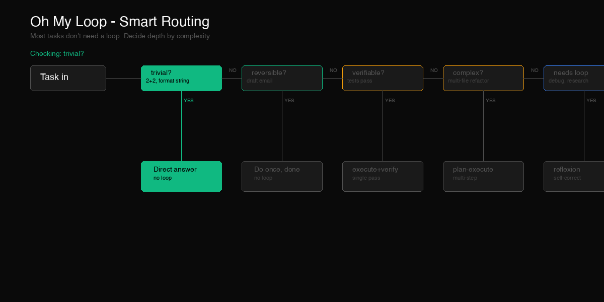

<div align="center">


# Oh My Loop

### A framework for designing good agentic loops.

Not another agent library. A methodology that helps you decide **when to loop, how deep, and when to stop.**

[](LICENSE)
[](core/patterns/)
[](examples/)

**Most tasks need a simpler loop than you think. Oh My Loop tells you how simple.**

[Why](#-why) · [How it works](#-how-it-works) · [Quick Start](#-quick-start) · [Patterns](#-patterns) · [Examples](#-examples)

</div>

---

## 🤔 Why

LLM agents fail in predictable ways:

- **Over-engineering** - wrapping single-step tasks in loops because "loops are powerful"
- **Under-verifying** - claiming "done" without running any check
- **Infinite reflection** - reflecting forever without terminating
- **No degradation** - assuming infinite budget, failing when it runs out
- **Letting users pick** - asking the user to choose patterns instead of deciding based on context

Oh My Loop fixes these by giving you:

1. **A router** that decides if you even need a loop
2. **Patterns** for when you do, chosen by failure mode
3. **Components** that compose into custom loops
4. **Examples** that show real loops end-to-end

> Good loops are not "teach the agent what to do" — they are "predict where the agent will fail, and block it preemptively."

## 🎬 How it works



**Read [using-oh-my-loop](using-oh-my-loop/SKILL.md) first.** It runs a decision tree in your head:

- Trivial task? -> answer directly, no loop
- Reversible + low stakes? -> do it once, done
- Verifiable + complex? -> pick a pattern by failure mode

The router auto-balances **effect / cost / efficiency** based on context — it does not ask the user. Human-in-the-loop only triggers for **irreversible actions, user data mutation, or cost overruns**.

## 🚀 Quick Start

```bash
git clone https://github.com/Madapexai/oh-my-loop.git
```

Point your agent at the skills:

```bash
# Claude Code / Cursor / Codex / any agent that loads SKILL.md files
export OH_MY_LOOP_SKILLS=/path/to/oh-my-loop
```

Then in your agent:

> "Use using-oh-my-loop to decide if I need a loop for this task."

That's it. The router will read the task, decide if a loop is needed, pick a pattern if so, and run it.

### Try the code

**Python:**
```bash
cd reference-implementations/python
python3 test_oh_my_loop.py
# ✅ All 13 tests passed
```

**TypeScript:**
```bash
cd reference-implementations/typescript
npm install && npm test
# ✅ 22 tests passed, 0 failed
```

**Benchmark:**
```bash
cd benchmarks
python3 router_accuracy_v2.py
# 250 tasks: EN 98%, multilingual 14% (honest)
```

### Run the benchmark yourself

```bash
git clone https://github.com/Madapexai/oh-my-loop.git
cd oh-my-loop/benchmarks
python3 router_accuracy.py
```

See [benchmarks/router-accuracy-report.md](benchmarks/router-accuracy-report.md) for full results.

## 📦 What's inside

```
oh-my-loop/
├── using-oh-my-loop/     # The router — read this first
├── write-a-loop/          # Meta-skill: design new loops
├── core/
│   ├── patterns/          # 5 reusable loop patterns
│   │   ├── react/         #   Reason + Act (unknown steps)
│   │   ├── reflexion/      #   Try, reflect, retry
│   │   ├── plan-execute/   #   Plan first, then execute
│   │   ├── self-refine/    #   Generate, critique, refine
│   │   └── multi-agent/    #   Multiple roles
│   └── components/         # Composable pieces
│       ├── verify-before-claim/
│       ├── task-decomposition/
│       ├── feedback-loop/
│       └── self-questioning/
├── examples/              # 8 end-to-end examples
│   ├── coding/
│   ├── debugging/
│   ├── research/
│   ├── refactor/
│   ├── content/
│   ├── testing/
│   ├── review/
│   └── planning/
└── docs/                  # Bilingual docs
    ├── en/
    └── zh/
```

## 🔀 Patterns

| Pattern | When to use | Termination |
|---|---|---|
| [react](core/patterns/react/SKILL.md) | Unknown steps, need to explore | max 10 iterations |
| [reflexion](core/patterns/reflexion/SKILL.md) | First attempt likely wrong, can verify | max 3 attempts |
| [plan-execute](core/patterns/plan-execute/SKILL.md) | Steps known, might do them wrong | max 2 re-plans |
| [self-refine](core/patterns/self-refine/SKILL.md) | Output needs polishing | max 3 refinements |
| [multi-agent](core/patterns/multi-agent/SKILL.md) | Needs multiple perspectives | max 2 rounds |

**Every pattern has:**
- When to use / when NOT to use
- The loop structure
- Checkpoints (entry / exit / failure / escalation)
- Constraints (cost / time / degradation)
- A worked example

## 📚 Examples

Each example is a complete loop end-to-end:

| Example | Pattern used | Task |
|---|---|---|
| [coding](examples/coding/loop.md) | plan-execute | Add an API endpoint with tests |
| [debugging](examples/debugging/loop.md) | reflexion | Fix an intermittent bug |
| [research](examples/research/loop.md) | react | Find the best agent framework |
| [refactor](examples/refactor/loop.md) | multi-agent | Refactor auth module |
| [content](examples/content/loop.md) | self-refine | Write a launch blog post |
| [testing](examples/testing/loop.md) | plan-execute | Generate test suite with 80% coverage |
| [review](examples/review/loop.md) | multi-agent | Review a PR for security, perf, style |
| [planning](examples/planning/loop.md) | react | Plan a REST-to-GraphQL migration |

Copy any example, replace the task and verification commands, and you have a working loop.

## 🧩 Components

Reusable pieces that compose into custom loops:

| Component | What it does |
|---|---|
| [verify-before-claim](core/components/verify-before-claim/SKILL.md) | Gate function: no claim without evidence |
| [task-decomposition](core/components/task-decomposition/SKILL.md) | Break tasks into verifiable subtasks |
| [feedback-loop](core/components/feedback-loop/SKILL.md) | Capture outcomes to improve future runs |
| [self-questioning](core/components/self-questioning/SKILL.md) | Multi-perspective check before committing |

## ✍️ Designing your own loop

If none of the patterns fit, use [write-a-loop](write-a-loop/SKILL.md). It walks you through a 5-step hard flow:

1. **Define goal** — what, why, success, failure modes (mandatory)
2. **Choose pattern** — by failure mode
3. **Define checkpoints** — entry / exit / failure / escalation for each step
4. **Define constraints** — cost / time / irreversible / degradation
5. **Write & test** — test against your own failure modes

## 🤝 Contributing

Contributions welcome. Read [CONTRIBUTING.md](CONTRIBUTING.md) first.

**We accept:**
- New patterns (with failure-mode analysis and examples)
- New examples (end-to-end, with verification commands)
- Improvements to existing patterns

**We do not accept:**
- Company-specific SOPs disguised as generic patterns
- "Loop for everything" wrappers
- Patterns without failure-mode analysis

## 📄 License

MIT — see [LICENSE](LICENSE).

---

<div align="center">

**Loop smart. Loop less. Ship more.**

</div>
