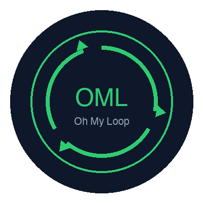
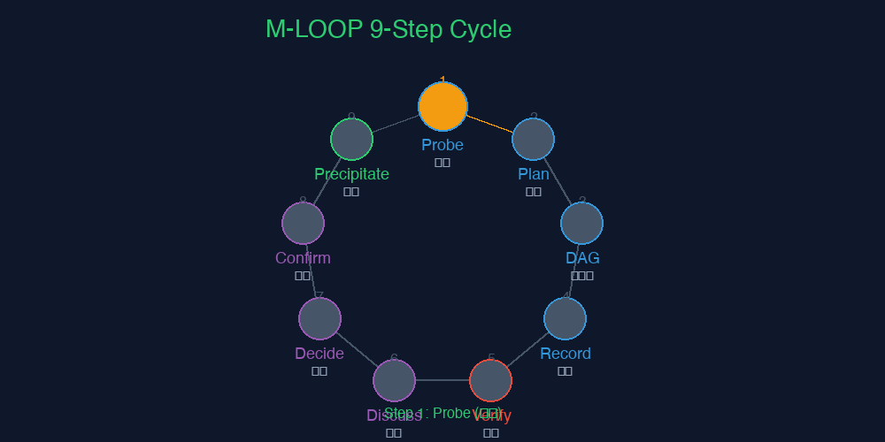
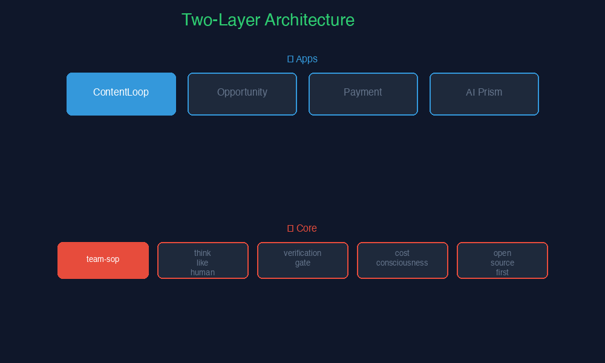
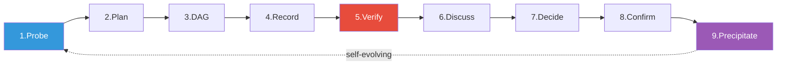
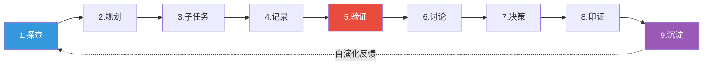

<div align="center">



# 🔄 Oh My Loop

**The self-evolving AI agent skill collection that runs in a loop.**

*Stop writing prompts from scratch. Give your AI agent battle-tested skills that loop, learn, and ship.*

[](https://github.com/Madapexai/oh-my-loop)
[](https://github.com/Madapexai/oh-my-loop)
[](https://opensource.org/licenses/MIT)
[]()
[]()
[]()

**31 skills · 2-layer architecture · self-learning engine · bilingual (中/EN)**

[English](#english) · [中文](#中文) · [Quick Start](#-quick-start) · [Architecture](#-architecture) · [Live Demo](#-live-demo)

</div>

---

# English

> Sounds boring. Let's try again.
>
> **Oh My Loop won't make your AI 10x smarter... but it will make it stop lying to you.**

Your AI agent says "done" without verifying. It says "should work" without running tests. It says "trust me" without evidence. **Oh My Loop fixes this.**

## 🎬 Live Demo

### M-LOOP 9-Step Cycle



*Watch the 9-step paradigm in action: Probe → Plan → DAG → Record → Verify → Discuss → Decide → Confirm → Precipitate → (loop back)*

### Two-Layer Architecture



*Core methodology engine (5 skills) + Apps application layer (26 skills) with self-evolving feedback loop.*

## 🧠 Why Oh My Loop?

| Feature | Oh My Loop | baoyu-skills (23k⭐) | superpowers (252k⭐) | content-pipeline (200⭐) |
|---------|------------|---------------------|----------------------|------------------------|
| 🔄 Self-evolving engine | ✅ | ❌ | ❌ | ❌ |
| 🏗️ 2-layer architecture | ✅ | ❌ flat | ❌ flat | ❌ flat |
| 🛡️ Verification gates | ✅ 4 types | ❌ | ✅ | ❌ |
| 📊 Multi-platform publish | ✅ 8 platforms | ✅ 5 | ❌ | ✅ 7 stages |
| 🇨🇳 Chinese scene depth | ✅ | ✅ | ❌ | ✅ |
| 💰 Cost control built-in | ✅ token-juice | ❌ | ❌ | ❌ |
| 🔓 Open-source-first help | ✅ 5 levels | ❌ | ❌ | ❌ |

## 🚀 Quick Start

### Install

| Method | Command |
|--------|---------|
| **git** | `git clone https://github.com/Madapexai/oh-my-loop.git ~/.oh-my-loop` |
| **curl** | `sh -c "$(curl -fsSL https://raw.githubusercontent.com/Madapexai/oh-my-loop/main/install.sh)"` *(WIP)* |
| **wget** | `sh -c "$(wget -O- https://raw.githubusercontent.com/Madapexai/oh-my-loop/main/install.sh)"` *(WIP)* |

### Use with your AI agent

**Claude Code / Trae / Cursor / any LLM:**

```bash
# Load all skills
export OH_MY_LOOP=~/.oh-my-loop

# Or selectively load core only
cp -r ~/.oh-my-loop/core/* ~/.trae-cn/skills/
```

**Verify installation:**

```bash
ls ~/.oh-my-loop/core/    # 5 skills
ls ~/.oh-my-loop/apps/    # 26 skills
```

**Try it - tell your AI:**

> "Use topic-analyzer to analyze the topic 'AI programming'"

Your AI now has 31 battle-tested skills. That's it. 🎉

## 🏗️ Architecture

```
oh-my-loop/
├── core/                          # ⚙️ Methodology engine (5 skills)
│   ├── team-sop/                  #   Team SOP master index
│   ├── think-like-human/          #   Think like a human methodology
│   ├── verification-gate/         #   Verification gates & checkpoints
│   ├── cost-consciousness/        #   Cost saving (token-juice)
│   └── open-source-first/         #   Open-source community help path
│
├── apps/                          # 🧠 Application scenarios (26 skills)
│   ├── content-loop/              #   Content loop (20 skills)
│   │   ├── topics/                #     Topic research (3)
│   │   ├── writing/               #     Writing (4)
│   │   ├── publishing/            #     Publishing (3)
│   │   ├── strategy/              #     Strategy (7)
│   │   └── learning/              #     Self-learning (1)
│   ├── opportunity-system/        #   Opportunity discovery
│   ├── payment/                   #   Payment integration
│   └── ai-prism/                  #   Bilingual column
│
├── docs/                          # 📚 Documentation
│   ├── architecture.md            #   Architecture deep dive
│   └── principles.md               #   How it works (principles)
│
└── plugins/                       # 🔌 Plugin extensions
```

## ⚙️ How It Works

### M-LOOP 9-Step Paradigm



### 6 Iron Laws (non-negotiable)

| # | Law | Trigger |
|---|-----|---------|
| 1 | **No Goal, No Action** | Before accepting a task |
| 2 | **No Verification, No Claim** | Before claiming done |
| 3 | **No Root Cause, No Fix** | Before fixing bugs |
| 4 | **Think Like a Human** | When researching/deciding |
| 5 | **Open-Source First** | When stuck |
| 6 | **Use mention API for @** | When @-mentioning |

📖 Full principles: [docs/principles.md](docs/principles.md)

## 📦 Skills Overview

### Core (5 skills)

| Skill | What it does |
|-------|-------------|
| [team-sop](core/team-sop/) | Master index + 6 Iron Laws |
| [think-like-human](core/think-like-human/) | 10 dimensions × 50 questions + multi-perspective debate |
| [verification-gate](core/verification-gate/) | 4 checkpoint types + 12 Red Flags + rationalization prevention |
| [cost-consciousness](core/cost-consciousness/) | Token saving + free-first + hidden cost detection |
| [open-source-first](core/open-source-first/) | 5-level help ladder + 8 community sources |

### Apps (26 skills)

<details>
<summary><b>📝 ContentLoop (20 skills) - click to expand</b></summary>

| Category | Skill | Description |
|----------|-------|-------------|
| Topics | topic-analyzer | 5-dimension topic analysis |
| | topic-monitor | Topic monitoring + change alerts |
| | trending-discover | 8-channel trending discovery |
| Writing | article-writer | 6 title formulas + 6 structures |
| | humanize-writing | De-AI-ify rewriting |
| | novel-writer | Novel 6-step pipeline |
| | video-script-writer | Video script + 6-layer pipeline |
| Publishing | content-publisher | 8-platform adaptation |
| | auto-publisher | Auto-publish engine |
| | cross-platform-sync | Cross-platform sync strategy |
| Strategy | content-strategist | Positioning + 12-month roadmap |
| | content-marketing | AARRR growth + 4 viral formulas |
| | content-analytics | Funnel analysis + A/B testing |
| | content-repurposer | One-to-many adaptation |
| | author-analyzer | Author deep-dive analysis |
| | comment-analyzer | Comment 4-dimension analysis |
| | knowledge-monetization | Monetization pyramid + MVP |
| Self-learning | self-learn | 3-layer memory + 4 evolution mechanisms |
| Master | content-os | ContentLoop master dispatcher |
| | content-os-quickstart | 5-minute quick start |

</details>

<details>
<summary><b>💳 Payment / 🔮 AI Prism / 📊 Opportunity System (11 skills)</b></summary>

| App | Skill | Description |
|-----|-------|-------------|
| Payment | creem-payment-integration | Creem cross-border payment (primary) |
| | alipay-payment-integration | Alipay domestic backup |
| AI Prism | ai-prism-writer | Bilingual writing standards |
| | ai-prism-publisher | Cross-platform publishing cadence |
| | ai-prism-repo | GitHub repo management + commit format |
| Opportunity | opportunity-system | 6-channel scan + 5-dim scoring + knowledge graph |

</details>

## 🆚 Comparison

### vs baoyu-skills (23k⭐)

baoyu-skills is a great flat collection of Claude Code skills.

**Oh My Loop's differences:**
- ✅ **2-layer architecture**: core methodology + apps scenarios (not flat)
- ✅ **Self-evolving engine**: skills learn from usage (baoyu-skills are static)
- ✅ **Verification gates**: 4 checkpoint types (baoyu-skills has none)
- ✅ **M-LOOP paradigm**: 9-step closed loop (baoyu-skills has no loop concept)

### vs superpowers (252k⭐)

superpowers is a general agentic skills framework, not content-specific.

**Oh My Loop's differences:**
- ✅ **Content-specific**: 20+ content creation skills (superpowers is general workflow)
- ✅ **Chinese scene**: deep adaptation for Xiaohongshu/Zhihu/WeChat (superpowers is English)
- ✅ **Cost built-in**: cost-consciousness skill (superpowers has none)
- ✅ **Open-source-first**: built-in help ladder (superpowers has none)

## 🤝 Contributing

Contributions welcome! Even just fixing a typo.

1. **Fork** the repo
2. **Create branch**: `git checkout -b feat/your-skill-name`
3. **Write skill**: follow [the template](core/team-sop/SKILL.md)
4. **Add examples**: at least 3 usage examples
5. **Submit PR**: one skill per PR

📖 Full guide: [CONTRIBUTING.md](CONTRIBUTING.md)

### Do Not Send Us...

- ❌ Theme-only PRs (we don't accept visual themes)
- ❌ Skill duplicates (check existing skills first)
- ❌ Skills without verification gates

---

# 中文

> 听起来无聊？再试一次。
>
> **Oh My Loop 不会让你的 AI 聪明 10 倍...但它会让它不再对你撒谎。**

你的 AI agent 说"完成了"却不验证。说"应该可以了"却不跑测试。说"相信我"却没证据。**Oh My Loop 解决这个问题。**

## 🧠 为什么选 Oh My Loop？

| 特性 | Oh My Loop | baoyu-skills (23k⭐) | superpowers (252k⭐) | content-pipeline (200⭐) |
|------|------------|---------------------|----------------------|------------------------|
| 🔄 自演化引擎 | ✅ | ❌ | ❌ | ❌ |
| 🏗️ 两层架构 | ✅ | ❌ 扁平 | ❌ 扁平 | ❌ 扁平 |
| 🛡️ 验证门控 | ✅ 4类 | ❌ | ✅ | ❌ |
| 📊 多平台发布 | ✅ 8平台 | ✅ 5 | ❌ | ✅ 7阶段 |
| 🇨🇳 中文场景深度 | ✅ | ✅ | ❌ | ✅ |
| 💰 成本控制内置 | ✅ token-juice | ❌ | ❌ | ❌ |
| 🔓 开源优先求助 | ✅ 5级阶梯 | ❌ | ❌ | ❌ |

## 🚀 快速开始

```bash
# 克隆
git clone https://github.com/Madapexai/oh-my-loop.git ~/.oh-my-loop

# 加载到你的 AI agent
export OH_MY_LOOP=~/.oh-my-loop

# 或者只加载底层 core
cp -r ~/.oh-my-loop/core/* ~/.trae-cn/skills/
```

**验证安装：**

```bash
ls ~/.oh-my-loop/core/    # 5 个底层 skill
ls ~/.oh-my-loop/apps/    # 26 个应用 skill
```

**试用 - 对你的 AI 说：**

> "用 topic-analyzer 分析一下'AI编程'这个选题"

你的 AI 现在有 31 个战场检验过的技能了。就这么简单。🎉

## ⚙️ 工作原理

### M-LOOP 9步闭环范式



### 6大铁律（不可妥协）

| # | 铁律 | 触发场景 |
|---|------|----------|
| 1 | **无Goal不行动** | 接任务前 |
| 2 | **无验证不声称** | 声称完成前 |
| 3 | **无根因不修复** | 修bug前 |
| 4 | **像人一样思考** | 调研/决策时 |
| 5 | **开源优先** | 卡住时 |
| 6 | **飞书@用mention API** | @人时 |

📖 完整原理：[docs/principles.md](docs/principles.md)

## 📦 Skills 一览

### 底层 Core（5个）

| Skill | 做什么 |
|-------|--------|
| [team-sop](core/team-sop/) | 总目录 + 6大铁律索引 |
| [think-like-human](core/think-like-human/) | 10维度×50问题 + 多视角辩论 |
| [verification-gate](core/verification-gate/) | 4类检查点 + 12条Red Flags + 合理化预防表 |
| [cost-consciousness](core/cost-consciousness/) | Token节约 + 免费优先 + 隐性成本识别 |
| [open-source-first](core/open-source-first/) | 5级求助阶梯 + 8社区查询清单 |

### 应用层 Apps（26个）

<details>
<summary><b>📝 ContentLoop 内容闭环（20个）- 点击展开</b></summary>

| 类别 | Skill | 说明 |
|------|-------|------|
| 选题 | topic-analyzer | 5维度选题分析 |
| | topic-monitor | 话题监测+变更告警 |
| | trending-discover | 8渠道热点发现 |
| 写作 | article-writer | 6标题公式+6结构 |
| | humanize-writing | 去AI感改写 |
| | novel-writer | 小说6步流水线 |
| | video-script-writer | 视频脚本+6层流水线 |
| 发布 | content-publisher | 8平台适配规则 |
| | auto-publisher | 自动化发布引擎 |
| | cross-platform-sync | 跨平台同步策略 |
| 策略 | content-strategist | 定位三角+12月路线图 |
| | content-marketing | AARRR增长+4爆款公式 |
| | content-analytics | 漏斗分析+A/B测试 |
| | content-repurposer | 一鱼多吃改编矩阵 |
| | author-analyzer | 对标作者拆解 |
| | comment-analyzer | 评论区4维度分析 |
| | knowledge-monetization | 变现金字塔+MVP验证 |
| 自学习 | self-learn | 3层记忆+4进化机制 |
| 总调度 | content-os | ContentLoop总目录 |
| | content-os-quickstart | 5分钟上手指南 |

</details>

<details>
<summary><b>💳 Payment / 🔮 AI Prism / 📊 商机系统（11个）</b></summary>

| 应用 | Skill | 说明 |
|-----|-------|------|
| 支付 | creem-payment-integration | Creem跨境支付（首选） |
| | alipay-payment-integration | 支付宝国内备选 |
| AI Prism | ai-prism-writer | 双语写作规范 |
| | ai-prism-publisher | 跨平台发布频率表 |
| | ai-prism-repo | GitHub仓库管理+commit格式 |
| 商机 | opportunity-system | 6渠道扫描+五维打分+知识图谱 |

</details>

## 🔌 插件

| 插件 | 状态 | 说明 |
|------|------|------|
| [openmaic](plugins/) | 🚧 WIP | 动效解释引擎，把skill执行过程可视化 |
| [loop-engineering](plugins/) | 📋 Planned | Loop工程方法论插件 |
| [voko-skills](plugins/) | 📋 Planned | VokoForge AI Agent Skills 兼容层 |

## 🤝 贡献

欢迎 PR！哪怕只是修一个 typo。

1. **Fork** 仓库
2. **创建分支**：`git checkout -b feat/your-skill-name`
3. **写skill**：参考 [模板](core/team-sop/SKILL.md)
4. **加示例**：至少 3 个使用示例
5. **提PR**：一个 skill 一个 PR

📖 完整指南：[CONTRIBUTING.md](CONTRIBUTING.md)

### 不要发这些 PR

- ❌ 纯主题 PR（我们不收视觉主题）
- ❌ 重复 skill（先检查已有 skill）
- ❌ 没有验证门控的 skill

---

<div align="center">

## ⭐ Star History

如果这个项目对你有帮助，点个 Star ⭐ 支持一下！

[](https://star-history.com/#Madapexai/oh-my-loop&Date)

---

**🔄 Loop everything. Learn every loop. Ship every day.**

Made with 🤝 by [Madapexai](https://github.com/Madapexai) · [MindApex](https://github.com/Madapexai)

[📝 Promotion Materials](assets/promotion-text.md) · [🎬 Video Script](assets/video-script.md) · [🎨 Assets](assets/)

</div>
