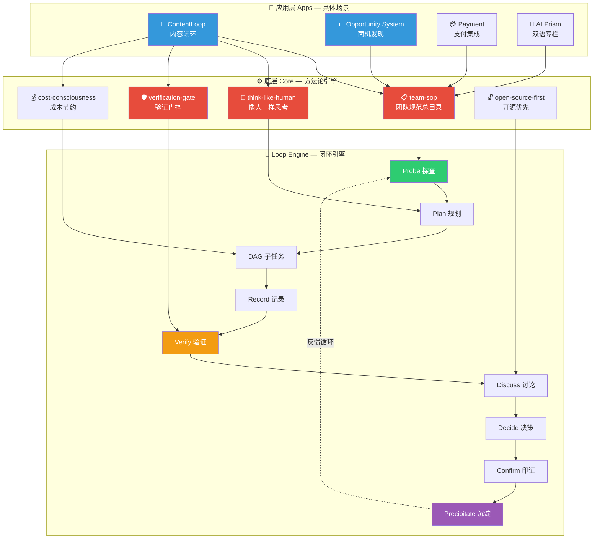
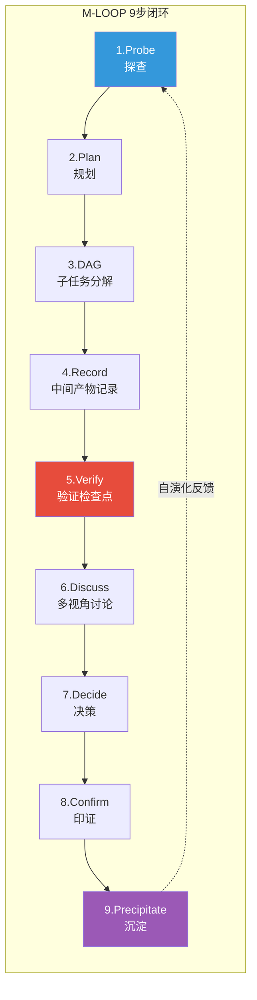
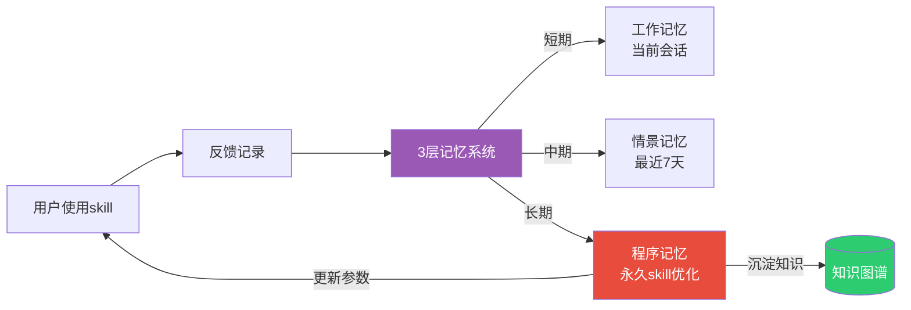

<div align="center">

# 🔄 Oh My Loop

### The self-evolving AI agent skill collection that runs in a loop.

**31 skills · 2-layer architecture · self-learning engine · bilingual**

[](https://github.com/Madapexai/oh-my-loop)
[](https://github.com/Madapexai/oh-my-loop)
[](https://opensource.org/licenses/MIT)
[]()
[]()

**Stop writing prompts from scratch. Give your AI agent battle-tested skills that loop, learn, and ship.**

[Quick Start](#-quick-start) · [Architecture](#-architecture) · [Skills](#-skills) · [Principles](#-how-it-works) · [Contributing](#-contributing)

</div>

---

## 🎬 30秒看懂

```bash
# 安装
git clone https://github.com/Madapexai/oh-my-loop.git ~/.oh-my-loop

# 加载到你的 AI agent（Claude Code / Cursor / Trae / any LLM）
export OH_MY_LOOP=~/.oh-my-loop

# 用起来 — 对你的 AI 说：
"用 topic-analyzer 分析一下 'AI编程' 这个选题"
# → AI 自动加载 topic-analyzer skill，输出5维度分析

"写一篇关于 M-LOOP 的深度文章"
# → article-writer 6步流水线启动

"发布到8个平台"
# → content-publisher 自动适配各平台格式
```

就这样，你的 AI agent 现在有 **31个战场检验过的技能** 了。

---

## 🧠 Why Oh My Loop?

市面上的 AI skill 集合要么是**静态脚本**（写完就不变了），要么是**单层扁平结构**（20个skill堆在一起没有架构）。

**Oh My Loop 不一样：**

| 特性 | Oh My Loop | baoyu-skills (23k⭐) | superpowers (252k⭐) | content-pipeline (200⭐) |
|------|------------|---------------------|----------------------|------------------------|
| 🔄 自演化引擎 | ✅ skill会自己进化 | ❌ | ❌ | ❌ |
| 🏗️ 两层架构（core+apps） | ✅ | ❌ 扁平 | ❌ 扁平 | ❌ 扁平 |
| 🛡️ 验证门控 | ✅ 4类检查点 | ❌ | ✅ | ❌ |
| 📊 多平台发布 | ✅ 8平台 | ✅ 5平台 | ❌ | ✅ 7阶段 |
| 🇨🇳 中文场景深度 | ✅ | ✅ | ❌ | ✅ |
| 💰 成本节约内置 | ✅ token-juice | ❌ | ❌ | ❌ |
| 🔓 开源优先求助路径 | ✅ 5级阶梯 | ❌ | ❌ | ❌ |

---

## 🏗️ Architecture

Oh My Loop 采用**两层架构**：底层是方法论核心引擎，上层是具体应用场景。



### 📁 目录结构

```
oh-my-loop/
├── core/                          # ⚙️ 底层：方法论引擎（5 skills）
│   ├── team-sop/                  #   团队规范总目录（索引）
│   ├── think-like-human/          #   像人一样思考方法论
│   ├── verification-gate/         #   验证门控与检查点
│   ├── cost-consciousness/        #   成本节约（token-juice）
│   └── open-source-first/         #   开源社区求助路径
│
├── apps/                          # 🧠 应用层：具体场景
│   ├── content-loop/              #   内容闭环（原ContentOS，20 skills）
│   │   ├── content-os/            #     总调度
│   │   ├── topics/                #     选题（topic-analyzer等3个）
│   │   ├── writing/               #     写作（article-writer等4个）
│   │   ├── publishing/            #     发布（content-publisher等3个）
│   │   ├── strategy/              #     策略（content-strategist等7个）
│   │   └── learning/              #     自学习（self-learn）
│   ├── opportunity-system/        #   商机发现系统
│   ├── payment/                   #   支付集成（creem + alipay）
│   └── ai-prism/                  #   AI Prism双语专栏
│
├── docs/                          # 📚 文档
│   ├── architecture.md            #   架构详解
│   ├── principles.md              #   动效原理
│   └── loop-engineering.md        #   Loop工程橙皮书
│
└── plugins/                       # 🔌 插件扩展
    └── README.md                  #   插件开发指南
```

---

## ⚙️ How It Works

Oh My Loop 的核心是 **M-LOOP 范式**（Multi-perspective Loop with Objective-Oriented Verification）— 一个让 AI agent 像人一样思考、验证、进化的闭环。



### 🔄 三个核心机制

#### 1. Iron Laws 铁律（不可妥协）

| 铁律 | 触发场景 | 说明 |
|------|----------|------|
| 无Goal不行动 | 接任务前 | 必须有明确goal和客观验收标准 |
| 无验证不声称 | 声称完成前 | 必须跑验证命令，出示新鲜证据 |
| 无根因不修复 | 修bug前 | 必须完成根因调查，不猜不试 |
| 像人一样思考 | 调研/决策 | 多问自己，多视角，多辩论 |
| 开源优先 | 不懂/卡住 | 90%概率开源社区有答案 |
| 飞书@用mention API | @人时 | 禁止文字@，零容忍 |

#### 2. Gate Functions 门控函数

每个关键动作都有自动验证门控：

```python
# 完成声称门控（伪代码）
def claim_complete(task):
    cmd = identify_verification_command(task)   # 1. 什么命令能证明？
    output = run(cmd)                           # 2. 执行（新鲜输出）
    result = read_full(output)                  # 3. 完整读取
    if verify(result, task.dod):                # 4. 验证
        return claim_with_evidence(result)     # 5. 带证据声称
    else:
        return state_with_evidence(result)      # 诚实陈述实际状态
```

#### 3. Self-Evolution 自演化引擎



**skill 不是静态的** — 每次使用都会记录反馈，self-learn 引擎自动优化参数，越用越懂你的风格。

> 📖 详细原理见 [docs/principles.md](docs/principles.md)

---

## 🚀 Quick Start

### 方式1：直接克隆（推荐）

```bash
git clone https://github.com/Madapexai/oh-my-loop.git ~/.oh-my-loop
```

### 方式2：选择性地加载skill

```bash
# 只加载底层core
cp -r ~/.oh-my-loop/core/* ~/.trae-cn/skills/

# 或只加载内容闭环应用
cp -r ~/.oh-my-loop/apps/content-loop/* ~/.trae-cn/skills/
```

### 方式3：在你的AI agent中引用

**Claude Code / Trae / Cursor：**

在你的项目 `AGENTS.md` 或 `.claude/skills` 中添加引用：

```markdown
## Skill Loading
- Core methodology: ~/.oh-my-loop/core/
- Content apps: ~/.oh-my-loop/apps/content-loop/
```

**验证安装：**

```bash
# 列出所有skill
ls ~/.oh-my-loop/core/
ls ~/.oh-my-loop/apps/

# 应该看到：
# core/         → 5 skills (team-sop, think-like-human, ...)
# apps/         → 26 skills (content-loop, payment, ai-prism, ...)
```

---

## 📦 Skills

### ⚙️ Core（底层方法论，5 skills）

| Skill | 做什么 | 关键能力 |
|-------|--------|----------|
| [team-sop](core/team-sop/) | 团队规范总目录 | 6大铁律 + 门控函数索引 + 检查点清单 |
| [think-like-human](core/think-like-human/) | 像人一样思考 | 10维度×50问题 + 多视角辩论 + 不着急回复 |
| [verification-gate](core/verification-gate/) | 验证门控 | 4类检查点 + Red Flags + 合理化预防表 |
| [cost-consciousness](core/cost-consciousness/) | 成本节约 | Token节约 + 免费资源优先 + 隐性成本识别 |
| [open-source-first](core/open-source-first/) | 开源求助 | 5级求助阶梯 + 8社区查询清单 |

### 🧠 Apps（应用层，26 skills）

#### 📝 ContentLoop — 内容闭环（20 skills）

| 类别 | Skill | 做什么 |
|------|-------|--------|
| **选题** | [topic-analyzer](apps/content-loop/topics/topic-analyzer/) | 5维度选题分析 |
| | [topic-monitor](apps/content-loop/topics/topic-monitor/) | 话题监测+变更告警 |
| | [trending-discover](apps/content-loop/topics/trending-discover/) | 8渠道热点发现 |
| **写作** | [article-writer](apps/content-loop/writing/article-writer/) | 6标题公式+6结构+15自检 |
| | [humanize-writing](apps/content-loop/writing/humanize-writing/) | 去AI感改写 |
| | [novel-writer](apps/content-loop/writing/novel-writer/) | 小说6步流水线 |
| | [video-script-writer](apps/content-loop/writing/video-script-writer/) | 视频脚本+6层流水线 |
| **发布** | [content-publisher](apps/content-loop/publishing/content-publisher/) | 8平台适配规则 |
| | [auto-publisher](apps/content-loop/publishing/auto-publisher/) | 自动化发布引擎 |
| | [cross-platform-sync](apps/content-loop/publishing/cross-platform-sync/) | 跨平台同步策略 |
| **策略** | [content-strategist](apps/content-loop/strategy/content-strategist/) | 定位三角+12月路线图 |
| | [content-marketing](apps/content-loop/strategy/content-marketing/) | AARRR增长+4爆款公式 |
| | [content-analytics](apps/content-loop/strategy/content-analytics/) | 漏斗分析+A/B测试 |
| | [content-repurposer](apps/content-loop/strategy/content-repurposer/) | 一鱼多吃改编矩阵 |
| | [author-analyzer](apps/content-loop/strategy/author-analyzer/) | 对标作者拆解 |
| | [comment-analyzer](apps/content-loop/strategy/comment-analyzer/) | 评论区4维度分析 |
| | [knowledge-monetization](apps/content-loop/strategy/knowledge-monetization/) | 变现金字塔+MVP验证 |
| **自学习** | [self-learn](apps/content-loop/learning/self-learn/) | 3层记忆+4进化机制 |
| **总调度** | [content-os](apps/content-loop/content-os/) | ContentLoop总目录 |
| | [content-os-quickstart](apps/content-loop/content-os-quickstart/) | 5分钟上手指南 |

#### 💳 Payment — 支付集成（2 skills）

| Skill | 做什么 |
|-------|--------|
| [creem-payment-integration](apps/payment/creem-payment-integration/) | Creem跨境支付（首选） |
| [alipay-payment-integration](apps/payment/alipay-payment-integration/) | 支付宝国内备选 |

#### 🔮 AI Prism — 双语专栏（3 skills）

| Skill | 做什么 |
|-------|--------|
| [ai-prism-writer](apps/ai-prism/ai-prism-writer/) | AI Prism双语写作规范 |
| [ai-prism-publisher](apps/ai-prism/ai-prism-publisher/) | 跨平台发布频率表 |
| [ai-prism-repo](apps/ai-prism/ai-prism-repo/) | GitHub仓库管理+commit格式 |

#### 📊 Opportunity System — 商机发现（1 skill）

| Skill | 做什么 |
|-------|--------|
| [opportunity-system](apps/opportunity-system/) | 6渠道扫描+五维打分+知识图谱 |

---

## 🆚 Comparison

### vs baoyu-skills (23k⭐)

baoyu-skills 是宝玉开源的 Claude Code skill 合集，**扁平结构**，覆盖内容理解/改写/封面/PPT。

**Oh My Loop 的区别：**
- ✅ **两层架构**：core 方法论 + apps 应用场景，不是扁平堆叠
- ✅ **自演化引擎**：skill 会自己进化，baoyu-skills 是静态的
- ✅ **验证门控**：4类检查点确保质量，baoyu-skills 没有
- ✅ **Loop范式**：M-LOOP 9步闭环，baoyu-skills 没有闭环概念

### vs superpowers (252k⭐)

superpowers 是通用 agentic skills framework，**不是内容专用**。

**Oh My Loop 的区别：**
- ✅ **内容专用**：20+ 内容创作skill，superpowers 是通用工作流
- ✅ **中文场景**：深度适配小红书/知乎/公众号/B站，superpowers 是英文生态
- ✅ **成本内置**：cost-consciousness skill 内置 token 节约，superpowers 没有
- ✅ **开源优先**：open-source-first skill 内置求助路径，superpowers 没有

---

## 🔌 Plugins

Oh My Loop 支持插件扩展。以下插件正在开发或已兼容：

| 插件 | 状态 | 说明 |
|------|------|------|
| [openmaic](plugins/) | 🚧 WIP | 动效解释引擎，把skill执行过程可视化 |
| [loop-engineering](plugins/) | 📋 Planned | Loop工程方法论插件 |
| [voko-skills](plugins/) | 📋 Planned | VokoForge AI Agent Skills 兼容层 |

> 📖 插件开发指南见 [plugins/README.md](plugins/README.md)

---

## 🤝 Contributing

欢迎PR！哪怕只是修一个typo。

### 贡献流程

1. **Fork** 仓库
2. **创建分支**：`git checkout -b feat/your-skill-name`
3. **写skill**：参考 [template-skill](core/team-sop/SKILL.md) 的格式
4. **加测试**：至少3个使用示例
5. **提PR**：一个skill一个PR

### Skill 编写规范

每个skill必须包含：

```markdown
---
name: your-skill-name
version: 1.0.0
description: "一句话说清做什么。当用户XXX时使用。"
---

# Skill 名称

## 核心理念
## 使用场景
## 工作流
## 检查点
## 相关skill引用
```

### 贡献者

感谢所有贡献者 🙏

[contributors placeholder - 将通过 GitHub Actions 自动生成]

---

## 📄 License

[MIT](LICENSE) — 随便用，改了记得留个名就行。

---

## ⭐ Star History

<div align="center">

如果这个项目对你有帮助，点个 Star ⭐ 支持一下！

</div>

---

<div align="center">

**🔄 Loop everything. Learn every loop. Ship every day.**

Made with 🤝 by [Madapexai](https://github.com/Madapexai) · [MindApex](https://github.com/Madapexai)

</div>
