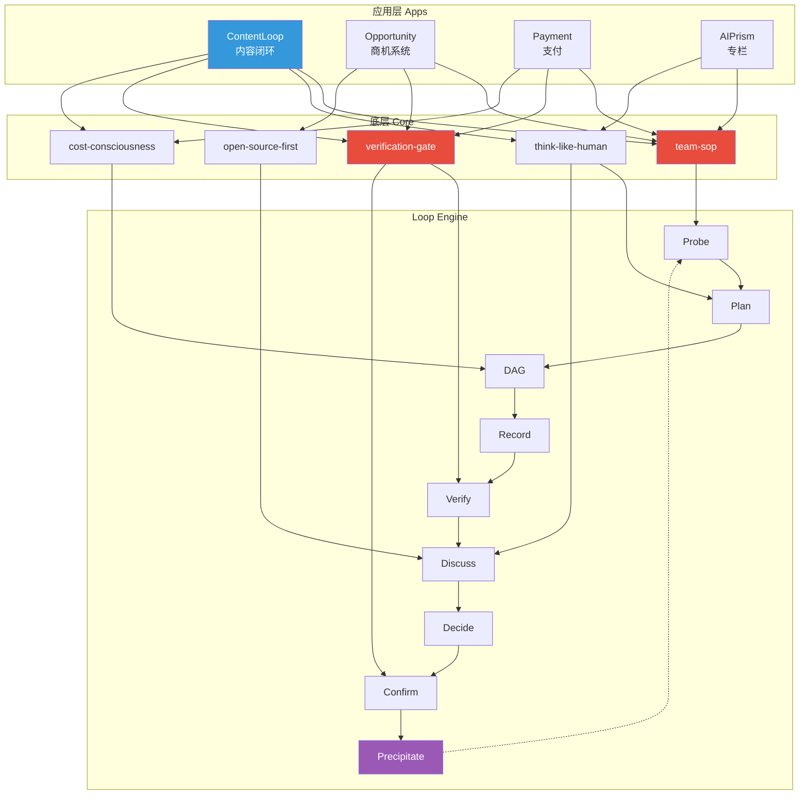
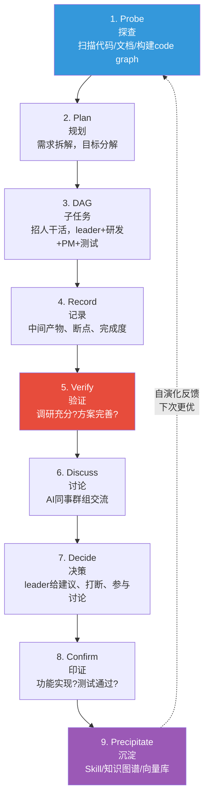
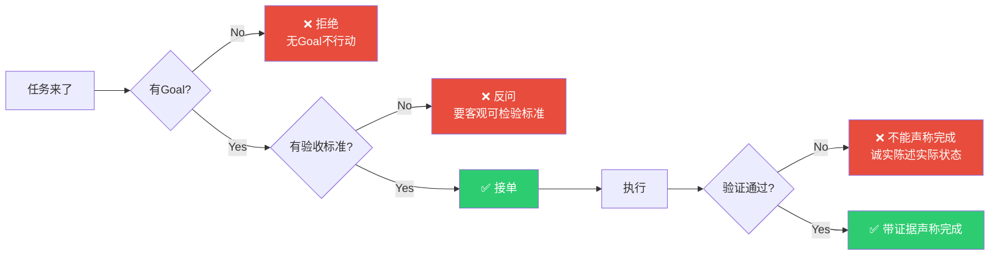
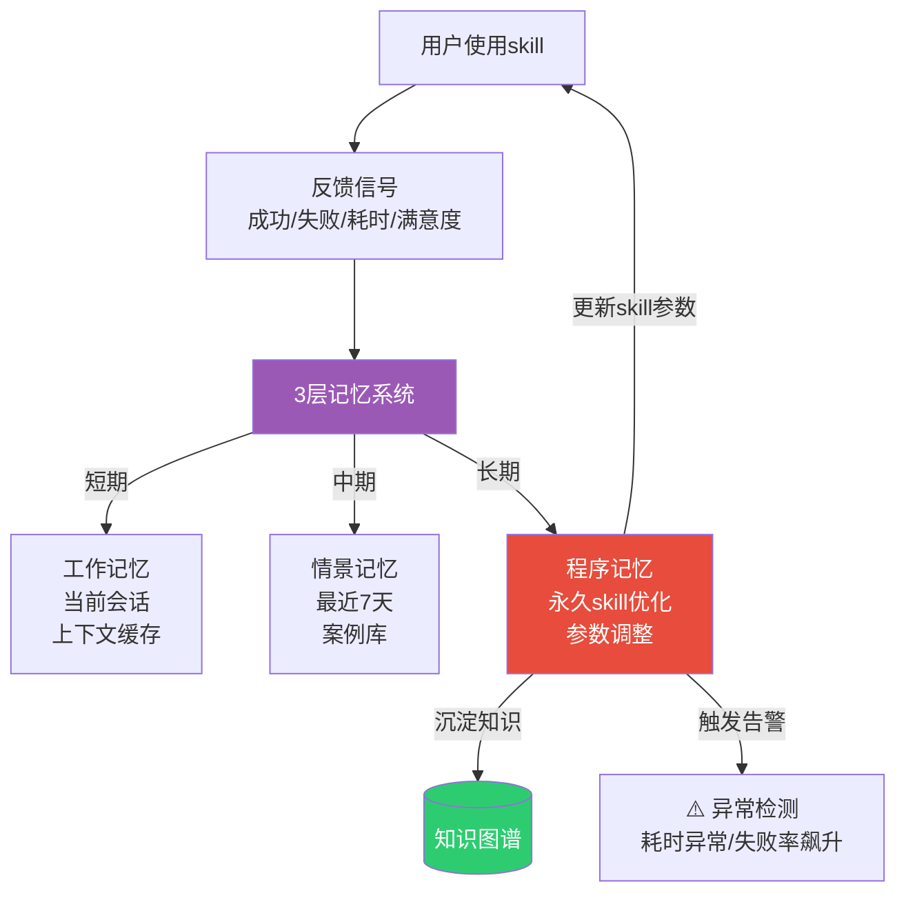
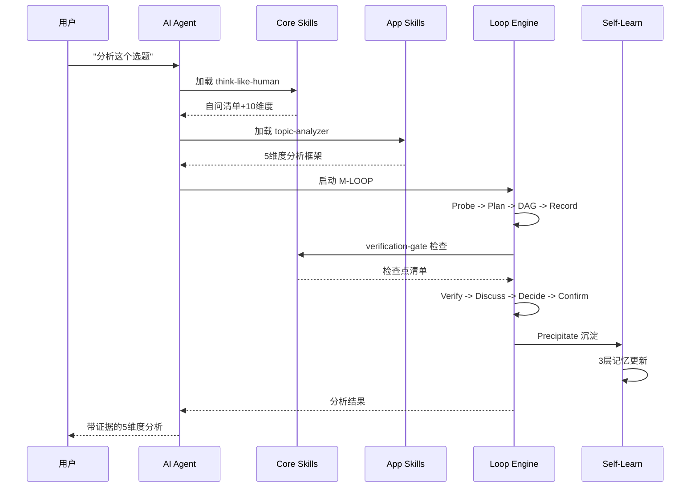

# 🏗️ Oh My Loop Architecture

> 详细架构说明。主README有速览版，这里有完整设计理念。

## 设计哲学

Oh My Loop 的设计哲学是 **"Loop, not Linear"**：

- **传统AI工作流**：`输入 -> 输出` （线性的，一次性）
- **Oh My Loop**：`输入 -> 探查 -> 规划 -> 执行 -> 验证 -> 沉淀 -> 反馈 -> 输入` （闭环的，自演化）

线性的AI agent每次都从零开始。Loop的AI agent每次都站在上一次的肩膀上。

## 两层架构



### 为什么分两层？

| 传统扁平结构 | Oh My Loop 两层架构 |
|-------------|---------------------|
| 20个skill平级堆叠 | core 是方法论，apps 是应用 |
| 每个skill都要自己定义验证 | core统一提供验证门控 |
| skill之间无引用 | apps引用core，形成层次 |
| 修改一个原则要改所有skill | 改core一个文件，所有apps自动继承 |
| 新场景要从零写skill | 新场景只需写差异，引用core |

### 底层 Core 的5个skill

| Skill | 职责 | 被谁引用 |
|-------|------|----------|
| team-sop | 总目录+铁律索引 | 所有apps |
| think-like-human | 调研+决策方法论 | 所有apps的调研环节 |
| verification-gate | 验证+检查点 | 所有apps的完成声称环节 |
| cost-consciousness | 成本控制 | 调用API/云资源的apps |
| open-source-first | 求助路径 | 卡住时的所有apps |

### 应用层 Apps 的4个场景

| App | 场景 | 引用的core |
|-----|------|------------|
| ContentLoop | 内容创作全链路 | team-sop, think-like-human, verification-gate, cost-consciousness |
| Opportunity System | 商机发现 | team-sop, open-source-first, verification-gate |
| Payment | 支付集成 | team-sop, verification-gate, cost-consciousness |
| AI Prism | 双语专栏 | team-sop, think-like-human |

## M-LOOP 9步范式



### 每一步的检查点

| 步骤 | 检查点 | 验证方法 |
|------|--------|----------|
| Probe | code graph构建完整? | 节点数 > 阈值 |
| Plan | 目标可量化? | 5W1H+DoD齐全 |
| DAG | 子任务可并行? | 依赖图无环 |
| Record | 中间产物已保存? | 文件存在 |
| Verify | 验证通过? | 检查点清单全✅ |
| Discuss | 多视角辩论过? | 正方/反方/裁判各1轮 |
| Decide | 决策有依据? | 数据支撑 |
| Confirm | 原始症状消除? | 回归测试通过 |
| Precipitate | 知识已沉淀? | skill已更新 |

## 核心机制

### 1. Iron Laws 铁律

铁律是**不可妥协**的。任何借口（"应该可以"、"就这一次"、"我累了"）都是合理化，必须识别并拒绝。



### 2. Gate Functions 门控函数

```python
# 伪代码：完成声称门控
def claim_complete(task):
    """
    Gate Function: 声称完成前必过
    跳过任何一步 = 撒谎，不是验证
    """
    # 1. IDENTIFY - 什么命令能证明这个claim?
    cmd = identify_verification_command(task.claim)
    
    # 2. RUN - 执行完整命令（新鲜输出，不是之前的）
    output = run(cmd)
    
    # 3. READ - 完整输出 + exit code + 失败数
    result = read_full(output, exit_code, failures)
    
    # 4. VERIFY - 输出是否确认claim?
    if not verify(result, task.dod):
        # NO -> 诚实陈述实际状态
        return state_with_evidence(result)
    
    # 5. CLAIM - 只有YES才能声称完成
    return claim_with_evidence(result)
```

### 3. Self-Evolution 自演化引擎



#### 自演化的4种机制

| 机制 | 说明 | 触发条件 |
|------|------|----------|
| ADD | 添加新知识 | 新案例 + 用户认可 |
| UPDATE | 更新已有知识 | 案例与已有知识冲突 |
| DELETE | 删除过时知识 | 连续3次失败 |
| NOOP | 不操作 | 案例与已有知识一致 |

## 数据流



## 扩展性

### 添加新 Core Skill

1. 在 `core/` 下创建目录
2. 写 SKILL.md（遵循规范）
3. 在 `core/team-sop/SKILL.md` 的索引中添加引用
4. 提PR

### 添加新 App Skill

1. 在 `apps/<场景>/` 下创建目录
2. 写 SKILL.md，引用core
3. 在app的总调度中添加路由
4. 提PR

### 添加新 App 场景

1. 在 `apps/` 下创建新目录（如 `apps/customer-service/`）
2. 创建总调度skill
3. 写应用skills，引用core
4. 更新主README的skill列表
5. 提PR
