# How Oh My Loop works

Oh My Loop separates a goal from the authority to act and a plausible result from verified completion.

## Contract first

A run begins with goal, decision owner, success evidence, harm guardrails, allowed actions, confirmation boundaries, budgets, memory policy, and stop conditions. Life tasks default to user ownership. Memory capability is on, while personal candidates require consent and review before becoming active.

## Safety-first routing

The order is deliberate:

1. The model interprets possible crisis, consequential decisions, privacy, other people, and irreversible/external actions from context.
2. The model chooses autonomy: stop and escalate, advice only, confirm before action, or bounded execution.
3. The model decides whether no loop, one action, verification, a primitive composition, or a custom adaptive strategy is useful.
4. Deterministic policy validates the structure and reduces unsafe autonomy without reclassifying the task.

Short wording never proves low risk.

## Recoverable controlled cycle

The model-authored plan is an initial hypothesis, not a fixed workflow. On every iteration the agent observes current state, chooses one bounded next action, and adapts or re-plans from new evidence. Pre-action gates check authority, scope, reversibility, consent, and budget. Execution returns a structured outcome and observations. Post-action gates require fresh evidence and check harm before `completed` is allowed.

```mermaid
stateDiagram-v2
    [*] --> Routing
    Routing --> Escalated: critical / no authority
    Routing --> Proposed: contract accepted
    Proposed --> AwaitingInput: material context missing
    AwaitingInput --> Proposed: user supplies input
    Proposed --> AwaitingConfirmation: external / irreversible / affects others
    Proposed --> AwaitingObservation: reversible and authorized
    AwaitingConfirmation --> AwaitingObservation: exact confirmation
    AwaitingObservation --> Proposed: evidence insufficient; adapt
    AwaitingObservation --> Completed: fresh evidence + verifier pass
    Proposed --> BudgetExhausted: iteration / time / estimated tokens
    Proposed --> Cancelled: user cancellation
```



Every event carries the SHA-256 hash of the previous event. Proposals may cite only existing ledger events. Completion may cite only observation events and must pass a separate verifier model call. Model confidence alone is never completion evidence.

The CLI is a control plane, not an arbitrary tool executor. `run` proposes one action; a user or host agent performs it and returns the observed result with `observe`. `resume` recovers interrupted work.

```bash
oh-my-loop run "verify whether this plan should continue" --json
oh-my-loop input <run-id> "the requested missing context"
oh-my-loop confirm <run-id> "<full exact pending action>"
oh-my-loop observe <run-id> "the result actually observed" --source tool
oh-my-loop status <run-id> --json
oh-my-loop resume <run-id>
```

Runs stop on evidence-backed completion, cancellation, time or cost budget, repeated non-progress, new risk, failed gates, or iteration limit. Partial and blocked results are normal outcomes, not errors to hide.

## Patterns and governance

`react`, `plan-execute`, `reflexion`, `self-refine`, and `multi-agent` describe agent behaviors. `decision`, `habit`, and `life-review` describe human-centered feedback structures. They are optional primitives rather than a closed pattern list: the model may compose them or create a task-specific bounded strategy. Composition never expands authority. Memory is a separate governed subsystem with consent, quarantine, provenance, expiry, correction, and forgetting.

Read the [trust model](trust-model.md) for threats and limitations, then [design a contract](../../write-a-loop/SKILL.md).

## Agent Team

`oh-my-loop team` is not a fixed Planner/Executor/Reviewer template. The model creates 2–6 roles justified by task semantics; up to four run concurrently. Roles are advisory, the coordinator preserves disagreement, and a verifier checks the synthesis. Resume runs only missing roles after interruption.

Role agreement is correlated when roles share the same model, provider, or evidence. The runtime records this limitation instead of treating role count as independent corroboration.
