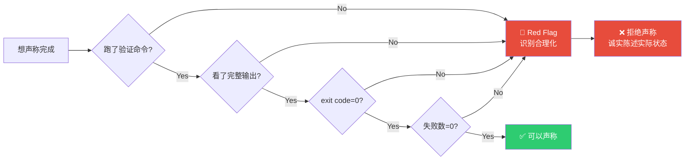
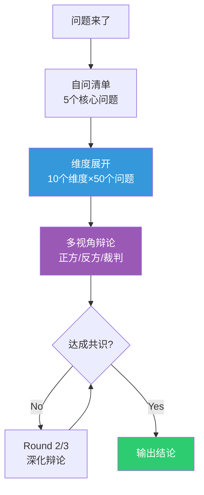
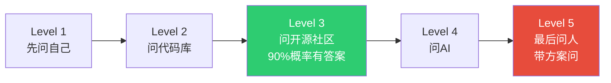
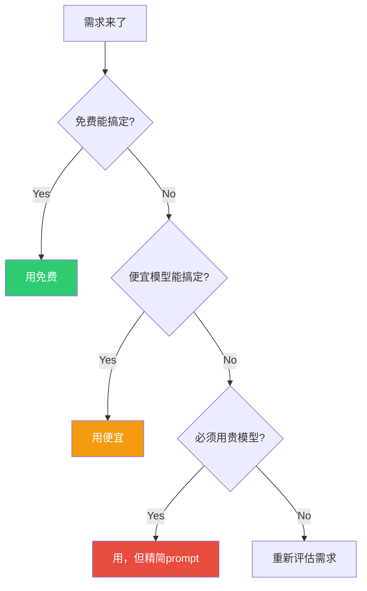
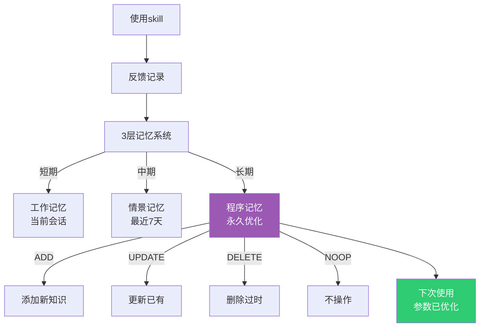
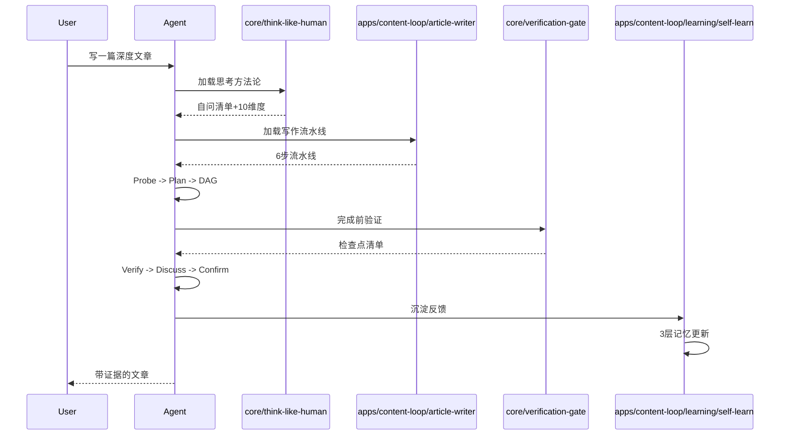

# ⚙️ How Oh My Loop Works — 动效原理

> 本文解释 Oh My Loop 的设计原理：为什么这样做，以及它如何让 AI agent 像人一样工作。

## 核心理念

> "像人一样，不断地问自己是不是还有别的渠道"
> "至少问自己10个维度，每个维度不少于50个问题"
> -- MindApex 创始人 Yason

传统AI agent的工作方式是**线性的**：

```
用户提问 -> AI回答 -> 结束
```

这种方式的问题：
- ❌ 每次都从零开始
- ❌ 没有验证就声称完成
- ❌ 不会自我质疑
- ❌ 不会多视角思考
- ❌ 不会从错误中学习

Oh My Loop 的方式是**闭环的**：

```
用户提问 -> 探查 -> 规划 -> 执行 -> 验证 -> 讨论 -> 决策 -> 印证 -> 沉淀 -> 反馈 -> 下次更优
```

## 6大原理

### 原理1：Iron Laws 铁律（不可妥协）

**问题**：AI agent经常"合理化"——给自己找借口跳过验证。

> "应该可以了" / "就这一次" / "我累了" / "看起来对了"

**解决方案**：把不可妥协的原则写成铁律，任何借口都自动识别并拒绝。



**参考开源**：verification-before-completion, systematic-debugging

### 原理2：Gate Functions 门控函数

**问题**：原则太空泛，"双重验证"怎么执行不清晰。

**解决方案**：每个关键动作都有**函数式门控**——输入、处理、输出明确。

```python
# 完成·声称·门控
def gate_claim_complete(task, claim):
    """
    Returns: (can_claim: bool, evidence: str)
    """
    # IDENTIFY
    cmd = task.verify_command  # 什么命令能证明?
    
    # RUN
    raw_output = subprocess.run(cmd, capture_output=True)
    
    # READ
    output = raw_output.stdout.decode()
    exit_code = raw_output.returncode
    failures = count_failures(output)
    
    # VERIFY
    checks = {
        "exit_code_zero": exit_code == 0,
        "no_failures": failures == 0,
        "output_contains_expected": task.expected in output,
        "original_symptom_gone": not task.symptom in output,
    }
    
    # CLAIM or STATE
    if all(checks.values()):
        return True, format_evidence(checks, output)
    else:
        return False, format_actual_state(checks, output)
```

### 原理3：像人一样思考

**问题**：AI经常浅思考——只看一个维度就下结论。

**解决方案**：强制多维度展开+多视角辩论。



#### 10个维度模板

1. 市场 2. 技术 3. 成本 4. 合规 5. 运营
6. 用户体验 7. 社区 8. 文档 9. 集成 10. 风险

#### 多视角辩论

```
正方：支持这个方案的理由（找优点）
反方：反对这个方案的理由（找缺点）  
裁判：综合判断，逼到最优
```

### 原理4：开源优先

**问题**：卡住就问人，浪费别人时间。

**解决方案**：5级求助阶梯，先查再问。



#### 开源社区查询清单

- GitHub Issues/Discussions
- Stack Overflow
- Reddit
- dev.to / Hashnode / Medium
- Product Hunter
- 微信公众号 / 知乎 / 掘金 / 小红书

### 原理5：成本意识

**问题**：烧token厉害，不知道省钱。

**解决方案**：免费优先+隐性成本识别+token节约。



### 原理6：自演化

**问题**：skill是静态的，不会进化。

**解决方案**：3层记忆+4种进化机制。



## 动效可视化

### 用 openmaic 可视化skill执行

> 📋 Planned：与 openmaic 插件集成，把skill执行过程生成动效GIF。



## 真实世界数据

参考 systematic-debugging 的统计：

| 方法 | 首次修复率 | 平均耗时 | 引入新bug |
|------|-----------|---------|----------|
| 系统方法（Oh My Loop） | 95% | 15-30分钟 | 接近0 |
| 瞎猜瞎试 | 40% | 2-3小时 | 常见 |

## 与其他框架的关系

Oh My Loop 不是凭空发明的，它整合了多个开源精华：

| 来源 | 借鉴了什么 | 我们的skill |
|------|-----------|------------|
| verification-before-completion | 无验证不声称 | verification-gate |
| systematic-debugging | 4阶段调试+3次熔断 | verification-gate |
| using-superpowers | skill发现+使用框架 | team-sop |
| grill-me | 多视角压力测试 | think-like-human |
| socratic-debate | 正方/反方/裁判 | think-like-human |
| self-evolving AI | 记忆系统+进化机制 | self-learn |

我们做的是**整合+中文场景适配+两层架构+Loop范式**。

## 扩展阅读

- [Architecture 详解](architecture.md)
- [M-LOOP 9步范式](loop-engineering.md) 📋 WIP
- [Skill 编写规范](../core/team-sop/SKILL.md)
