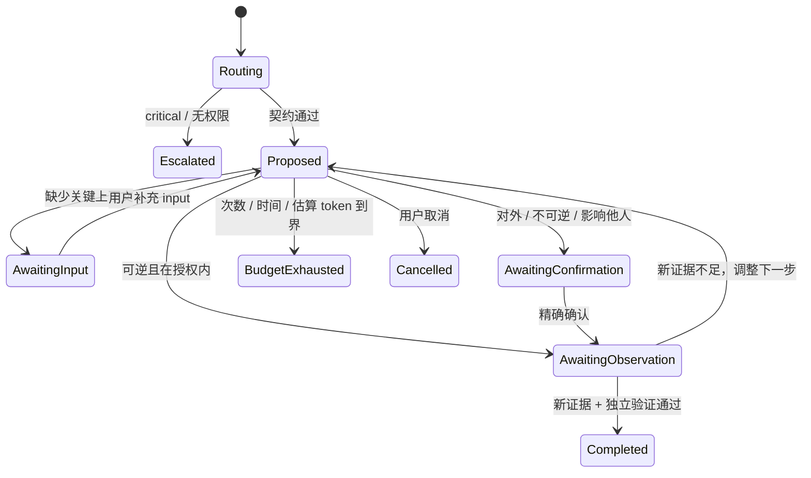

# Oh My Loop 如何工作

Oh My Loop 把“目标”和“执行权限”分开，也把“看起来不错”和“有证据的完成”分开。

## 先写契约

每次运行先明确：目标、决策者、成功证据、伤害护栏、允许动作、确认边界、时间/成本/次数预算、记忆政策和停止条件。生活任务默认由用户决策。记忆能力默认开启，但个人候选记忆必须经过同意和审阅才能激活。

## 安全优先路由

顺序不能颠倒：

1. 模型从完整语境理解可能的危机、重大人生决定、隐私、他人权益和不可逆/对外动作。
2. 模型决定自治等级：停止并升级、仅提供建议、动作前确认、或在边界内执行。
3. 模型决定无需 Loop、单次动作、执行加验证、组合原语，还是生成任务专属的自适应策略。
4. 确定性策略只验证结构并降低不安全的自治权限，不重新解释任务语义。

文字很短不代表风险很低。

## 可恢复的受控循环

模型生成的 Loop 计划只是初始假设，不是固定工作流。每一轮 Agent 都先观察当前状态，再选择一个有边界的下一步，并根据新证据调整或重新规划。动作前闸门检查权限、范围、可逆性、同意和预算；执行返回结构化结果与观测；动作后闸门要求新鲜证据并检查副作用，之后才能标记 `completed`。



每个事件都记录前一个事件的 SHA-256 哈希。提案必须引用账本中已经存在的事件；完成声明只能引用真实的 `observation` 事件，并由单独的验证模型调用复核。因此“模型觉得做完了”不等于完成。

CLI 是控制面，不是任意工具执行器：`run` 给出一个动作，用户或宿主 Agent 执行后用 `observe` 回填事实。进程中断后用 `resume` 恢复。

```bash
oh-my-loop run "验证这个方案是否值得继续" --json
oh-my-loop input <run-id> "模型请求的缺失上下文"
oh-my-loop confirm <run-id> "<完整且精确的待确认动作>"
oh-my-loop observe <run-id> "实际观察到的结果" --source tool
oh-my-loop status <run-id> --json
oh-my-loop resume <run-id>
```

满足证据、用户取消、预算耗尽、重复无进展、出现新风险、闸门失败或达到次数上限都会停止。`partial`、`blocked` 和 `escalated` 是正常且诚实的结果。

## 模式与治理

`react`、`plan-execute`、`reflexion`、`self-refine`、`multi-agent` 描述代理行为；`decision`、`habit`、`life-review` 描述以人为中心的反馈结构。它们是可选原语而不是封闭模式列表；模型可以自由组合，也可以生成任务专属的有界策略，但不能扩大权限。记忆是独立治理的系统，需要同意、隔离、来源、期限、纠正和遗忘。

先读[可信模型](trust-model.md)，再用[循环契约设计指南](../../write-a-loop/SKILL.md)。

## Agent Team

`oh-my-loop team` 不是固定的“规划者/执行者/审查者”模板。模型按任务语义生成 2–6 个必要角色，运行时最多并行 4 个；所有角色只做建议，协调器必须保留分歧，验证器再检查综合结论。中断后只补跑缺失角色。

多个角色若使用同一个模型或证据源，其一致意见具有相关性，不能被当成多份独立证据。系统会明确保存这个限制。
